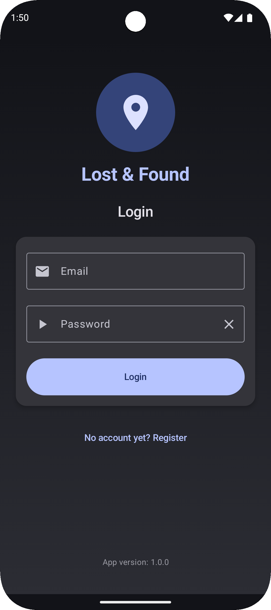
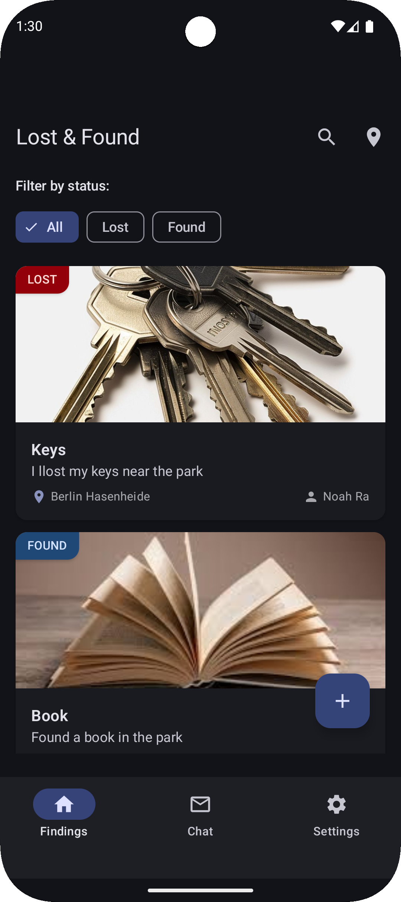
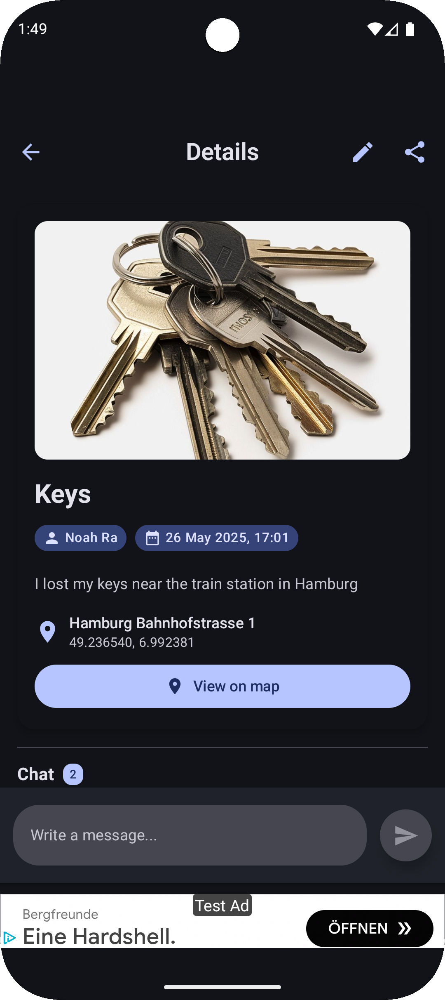
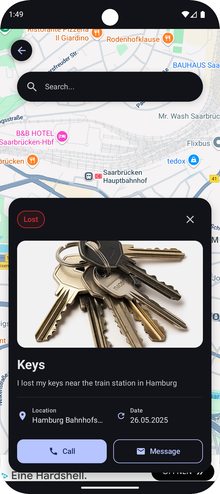
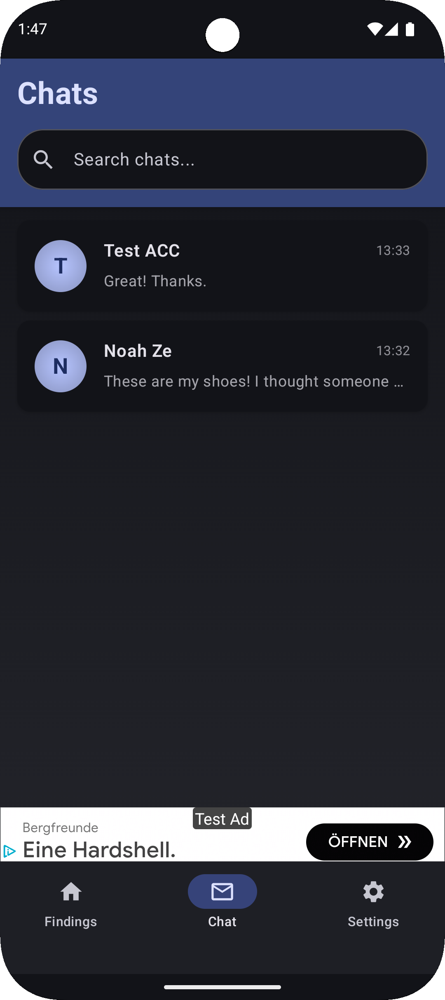

# Lost & Found – "Finde, was verloren ging."

**Du hast etwas verloren oder gefunden? Unsere App verbindet Menschen, um verlorene Dinge wiederzufinden. Schnell, lokal und anonym.**

**Lost & Found** ist eine schlanke Android-App, mit der du Gegenstände als *verloren* oder *gefunden* melden kannst. Du lädst ein Foto hoch, beschreibst den Gegenstand, gibst den Fund-/Verlustort an und hilfst damit anderen, ihre Sachen wiederzufinden.

### 🎯 Für wen?
Für ehrliche Finder:innen, verzweifelte Verlierer:innen – und alle, die gern helfen.

### ❓ Was macht die App besonders?
- 💬 Klare Fokussierung auf einen Zweck – ohne Werbung, ohne Ablenkung  
- 📍 Standortbasiert & visuell – einfach melden, einfach finden  
- 🔐 Sicherer Login via Firebase  
- 🎨 Intuitive Bedienung dank moderner Architektur und sauberem Design

---

## 📲 Features

-  📸 Gegenstand melden (Foto, Beschreibung, Standort, Zeit)
-  🔐 Login / Registrierung via Firebase
-  📍 Standortabfrage (GPS oder manuelle Eingabe)
-  🗂️ Liste mit Filter (Verloren / Gefunden / Zeit)
-  🧭 Navigation (Login → Dashboard → Details → Neue Meldung)
-  💾 Datenspeicherung in Firestore
-  🔎 API-Integration: Reverse-Geocoding (Ort aus Koordinaten)
-  🛡️ Fehlerhandling bei Login, Upload & Netzwerk
-  🧪 Testdaten, um die App zu demonstrieren
-  🗨️ Kommentare unter Meldungen
-  🌐 Mehrsprachigkeit (DE/EN)

---

## 📸 Screenshots

  
  
  
  
  

---

## 🛠 Technischer Aufbau

### 🧱 Projektstruktur & Architektur
Die App folgt dem **MVVM-Pattern** mit **Repository Layer**, um eine saubere Trennung von Logik, UI und Datenzugriff zu gewährleisten.  
Die Navigation erfolgt mit der Jetpack Navigation Component, und UI-Elemente sind in wiederverwendbare **Komponenten** ausgelagert.

### 💾 Datenspeicherung
Die App nutzt **Firebase Firestore** zur Speicherung von Meldungen und **Firebase Auth** für sichere Nutzeranmeldung.  
Gründe für die Wahl:
- Cloudbasiert & skalierbar
- Echtzeit-Updates
- Offline-Support mit automatischer Synchronisierung

### 🌐 API Calls
Für Standortdaten wird eine Reverse-Geocoding-API (z. B. **OpenCage Geocoder**) verwendet.  
Die Anbindung erfolgt über **Retrofit** und **Moshi** für JSON-Verarbeitung.

### 📦 Verwendete Libraries
- 🔥 Firebase Auth & Firestore  
- 📡 Retrofit & Moshi  
- 📍 Google Maps / Location Services  
- 🧭 Jetpack Navigation  
- 🧪 ggf. Room für spätere lokale Speicherung

---

## 🔮 Ausblick – Geplante Erweiterungen

✨ Die Basis steht – aber Lost & Found soll weiter wachsen. Hier ein Blick in die Zukunft:

- 🚨 **Push-Benachrichtigungen**: Lass dich benachrichtigen, wenn ein passender Fund in deiner Nähe gemeldet wird.
- 🗺️ **Kartendarstellung**: Alle Meldungen direkt auf einer Map anzeigen – visuelle Suche wird einfacher.
- 🛡️ **Admin-Modus**: Unangemessene oder doppelte Inhalte moderieren.
- 🧑‍🤝‍🧑 **Mehr Interaktion**: Bewertungen, Nachrichten oder Dankes-Funktion.
- 🌓 **Dark Mode**: Für angenehmes Browsen auch nachts.
- 📱 **iOS-Port (Kotlin Multiplatform)**: Damit niemand ausgeschlossen ist.
- 🌐 **Internationalisierung (DE/EN/...)**: Damit auch Touristen verlorene Dinge melden können.
